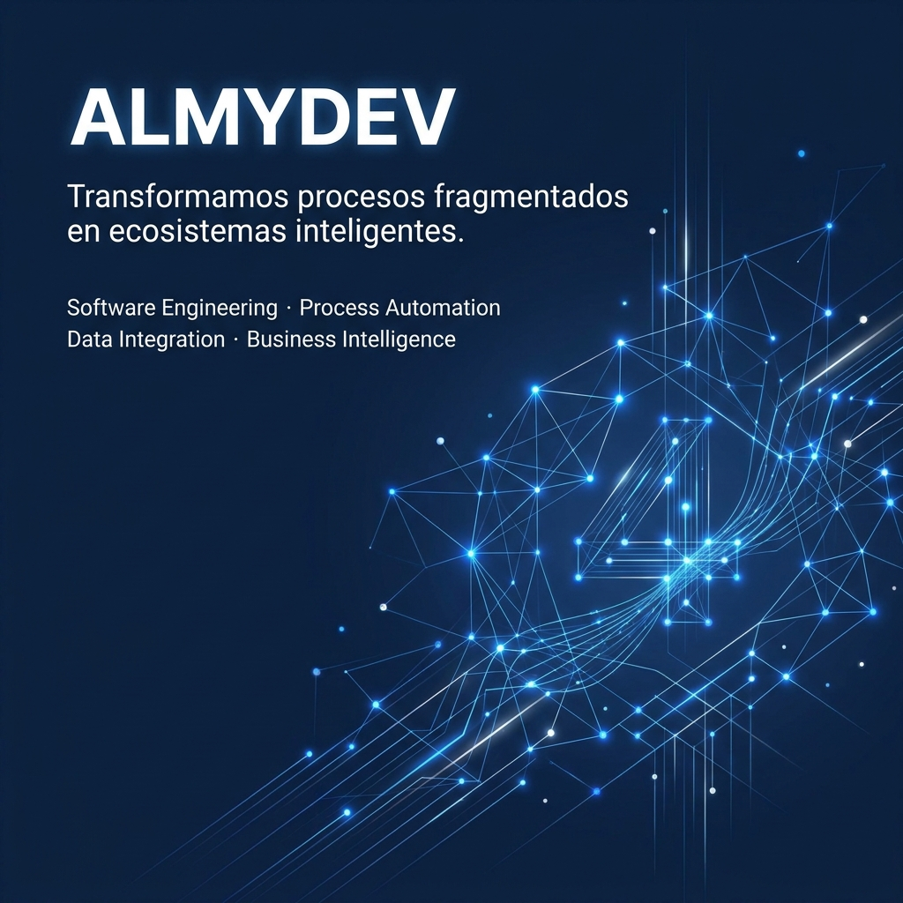

  

 

<h3 align="center">
Transformamos procesos fragmentados en ecosistemas inteligentes
</h3>

Información que fluye • Procesos conectados • Empresas que crecen

 

  <a href="#cuando-la-informacion-deja-de-fluir">Problema</a> •
  <a href="#nuestra-respuesta">Solución</a> •
  <a href="#capacidades-estrategicas">Capacidades</a> •
  <a href="#areas-que-transformamos">Sectores</a> •
  <a href="#ecosistema-tecnologico">Tecnologías</a> •
  <a href="#nuestra-filosofia">Filosofía</a>

---

# Cuando la información deja de fluir

Las organizaciones modernas generan grandes cantidades de información, pero gran parte de ella permanece distribuida entre hojas de cálculo, correos electrónicos, sistemas desconectados y procesos manuales.

Esta fragmentación genera retrasos operativos, reprocesos, errores de gestión y limita la capacidad de tomar decisiones basadas en datos confiables.

Cuando la información no fluye correctamente, el crecimiento se vuelve más complejo.

---

# Nuestra respuesta

ALMYDEV diseña soluciones tecnológicas orientadas a conectar procesos, integrar información y automatizar operaciones.

Nuestro objetivo es construir ecosistemas digitales donde los datos fluyan con claridad, los procesos sean trazables y las organizaciones puedan enfocarse en crecer.

No desarrollamos software por desarrollar software.

Diseñamos soluciones que generan eficiencia, control y capacidad de evolución.

---

# Lo que buscamos transformar

| Situación Actual      | Resultado Esperado           |
| --------------------- | ---------------------------- |
| Información dispersa  | Información centralizada     |
| Procesos manuales     | Procesos automatizados       |
| Sistemas aislados     | Ecosistemas conectados       |
| Reportes tardíos      | Información en tiempo real   |
| Decisiones reactivas  | Decisiones basadas en datos  |
| Dependencia operativa | Escalabilidad organizacional |

---

# Capacidades Estratégicas

### Ingeniería de Software

Desarrollo de plataformas empresariales diseñadas para acompañar el crecimiento de las organizaciones.

### Automatización Inteligente

Optimización de procesos mediante flujos digitales eficientes y reducción de tareas manuales.

### Integración Empresarial

Conexión de sistemas, aplicaciones y fuentes de información para eliminar silos operativos.

### Inteligencia Operativa

Transformación de datos en información estratégica para apoyar la toma de decisiones.

### Consultoría Tecnológica

Diagnóstico, rediseño y evolución de procesos organizacionales.

---

# Cómo trabajamos

### 01 · Diagnóstico

Analizamos procesos, flujos de información y necesidades del negocio.

### 02 · Diseño

Definimos la arquitectura funcional y tecnológica de la solución.

### 03 · Implementación

Construimos e integramos las herramientas necesarias para alcanzar los objetivos.

### 04 · Evolución

Acompañamos el crecimiento de la solución y su mejora continua.

---

# Áreas que transformamos

* Recursos Humanos
* Operaciones
* Inventarios
* Compras
* Ventas
* Servicio al Cliente
* Gestión Documental
* Finanzas
* Planeación Estratégica

---

# Ecosistema Tecnológico

Java • Spring Boot • React • Python

PostgreSQL • Docker • APIs • GitHub Actions

Google Workspace • Integraciones • Automatización

---

# Nuestra Filosofía

La tecnología no debe añadir complejidad.

Debe eliminarla.

Creemos que los procesos eficientes nacen cuando la información fluye con claridad entre las personas, los sistemas y las decisiones.

Por ello diseñamos soluciones que simplifican operaciones, integran información y potencian el crecimiento organizacional.

 

<strong>PRECISIÓN</strong> •
<strong>INTEGRACIÓN</strong> •
<strong>TRAZABILIDAD</strong> •
<strong>ESCALABILIDAD</strong> •
<strong>INNOVACIÓN</strong>

---

# Evolución

### Presente

* Desarrollo de Software Empresarial
* Automatización de Procesos
* Integración de Información
* Consultoría Tecnológica

### Futuro

* Plataformas SaaS
* Inteligencia Artificial Aplicada
* Analítica Empresarial Avanzada
* Ecosistema de Productos ALMYDEV

---

# Conectemos

ALMYDEV

Información que fluye. Empresas que crecen.

GitHub: https://github.com/Almydev
